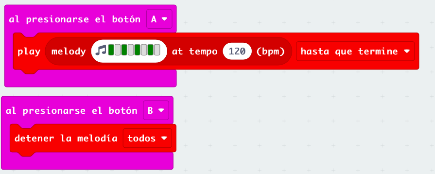
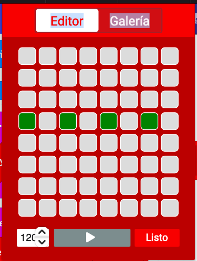
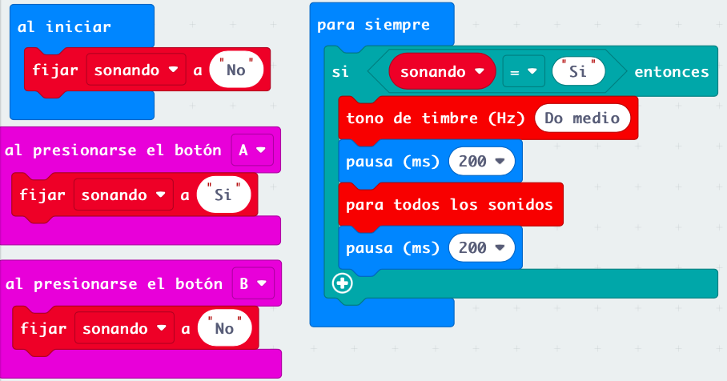
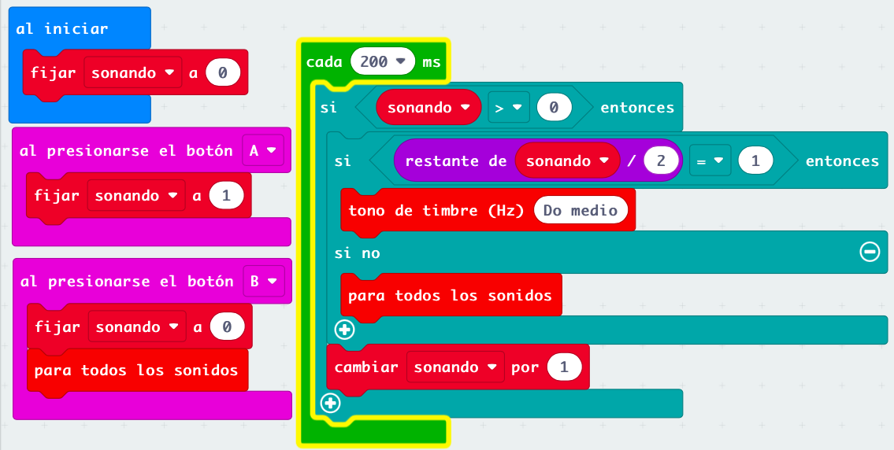
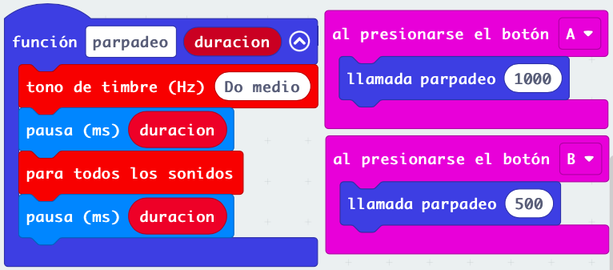
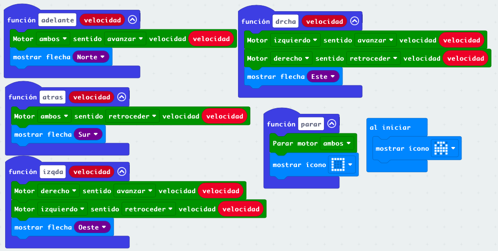
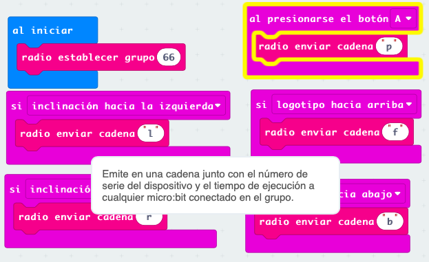
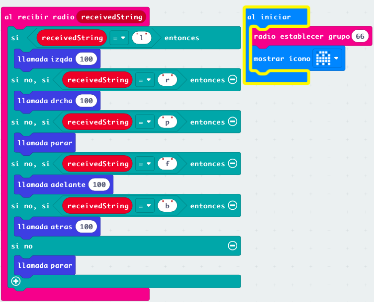

# Sesión 1 - Programación y movimiento con maqueen

## Sonidos intermitentes

Vamos a hacer que la pulsación de un botón arranque un sonido intermitente y que al pulsar el otro se detenga

### Versión 1

Usamos los eventos de pulsación de botón para activar el sonido y para paralo

Preparamos una melodía con sonidos intermitentes

[Sonido intermitente v1](https://makecode.microbit.org/S83929-64458-91525-50533)

## Versión 2 evento, bucle mientras y detección de estado del botón

Usamos un evento para la detección del botón de arranque del sonido y usamos el bucle mientras con la condición de detección de estado del otro botón

Cómo lo que queremos es que se repita mientras no se pulse, negamos la condición con el operador lógico

[Sonido intermitente v2](https://makecode.microbit.org/S93585-94728-48347-55727)

## Versión 3 con variable global

Usamos una variable global que guarda el estado del sonido. Al pulsar los botones cambiamos el valor de la variable.

En el bucle "por siempre" comprobamos el valor de la variable.

Este tipo de programa se llama máquina de estados, pues controla el estado de nuestro sistema y permite cambiar de unos a otros. 

En nuestro caso tenemos el estado sonando y el no sonando

[Sonido intermitente v3](https://makecode.microbit.org/S25972-02422-38938-57616)

## Versión 3.1 variable global númerica y 3 estados

Podemos refinar el ejemplo anterior añadiendo un tercer estado: sin sonido, sonando, silencio. Podemos controlar estos 3 estados con una variable global numérica:

* Si vale 0: no hay que hacer nada
* Si es impar suena
* Si es par reproducimos un silencio

La ventaja es que ahora no tenemos ninguna pausa en nuestro código

[Sonido intermitente 3.1](https://makecode.microbit.org/S69739-29329-23873-20608)

## Función parpadeo con duración variable

Vamos a definir una función que hace un parpadeo entre imágenes con una duración variable. Para ello creamos una función con un argumento de tipo numérico

[Parpadeo variable](https://makecode.microbit.org/S93091-01801-85877-08622)

## Funciones de movimiento de maqueen

Vamos a definir las funciones básicas de movimiento del robot maqueen, así podremos usarlas más fácilmente en nuestros programas.

[Funciones de movimiento de maqueen](https://makecode.microbit.org/S10944-32339-22929-71481)

## Control de maqueen por radio

Usaremos la funciones de movimiento para mover nuestro maqueen según lo datos que reciba por radio de otra micro:bit que es la que usaremos para controlar

[Mando](https://makecode.microbit.org/S15891-40327-08248-29896)

Al recibir comandos en maqueen ejecutamos las funciones correspondientes

[Programa maqueen remoto](https://makecode.microbit.org/S05249-11027-72910-27532)